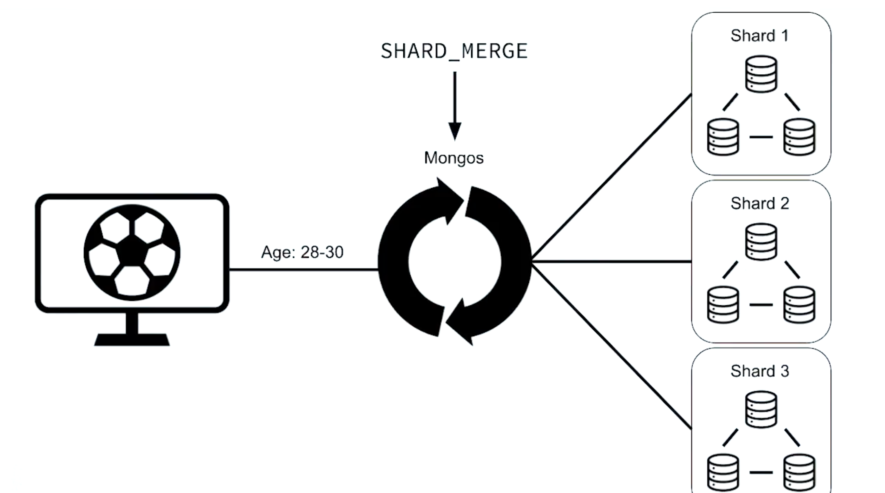

# Chapter 3 - Sharding

## What is Sharding?

In MongoDB, scaling is sone horizontally, which means instead of making the individual machines better, we just add more machines and distribute the dataset.

Mongos uses the metadata about which data is contained on each shard. And that metadata is stored on the Config servers.

- **Shards**: store distributed collections
- **Config Server**: store metadata about each server
- **Mongos**: routes queries to shards

## When to Shard?

Economically Viable to Scale Up

- Throughput
- Speed
- Volume

### Question

Which of the following scenarios drives us to shard our cluster?

- When we reach the most powerful servers available, maximizing our vertical scale options.
- Data sovereignty laws require data to be located in a specific geography.
- When holding more than 5TB per server and operational costs increase dramatically.

## Sharding Architecture



### Question

What is true about the primary shard in a cluster?

- Shard merges are performed by the mongos.
- Non-sharded collections are placed on the primary shard.
- The role of primary shard is subject to change.

## Setting Up a Sharded Cluster

```bash
mkdir -p /var/mongodb/pki/
openssl rand -base64 741 > /var/mongodb/pki/m103-keyfile
chmod 400 /var/mongodb/pki/m103-keyfile
mkdir -p /var/mongodb/db/csrs1
mkdir -p /var/mongodb/db/csrs2
mkdir -p /var/mongodb/db/csrs3
```

### Configuration files

```bash
sharding:
  clusterRole: configsvr
replication:
  replSetName: m103-csrs
security:
  keyFile: /var/mongodb/pki/m103-keyfile
net:
  bindIp: localhost,192.168.103.100
  port: 26001
systemLog:
  destination: file
  path: /var/mongodb/db/csrs1.log
  logAppend: true
processManagement:
  fork: true
storage:
  dbPath: /var/mongodb/db/csrs1
```

```bash
sharding:
  clusterRole: configsvr
replication:
  replSetName: m103-csrs
security:
  keyFile: /var/mongodb/pki/m103-keyfile
net:
  bindIp: localhost,192.168.103.100
  port: 26002
systemLog:
  destination: file
  path: /var/mongodb/db/csrs2.log
  logAppend: true
processManagement:
  fork: true
storage:
  dbPath: /var/mongodb/db/csrs2
```

```bash
sharding:
  clusterRole: configsvr
replication:
  replSetName: m103-csrs
security:
  keyFile: /var/mongodb/pki/m103-keyfile
net:
  bindIp: localhost,192.168.103.100
  port: 26003
systemLog:
  destination: file
  path: /var/mongodb/db/csrs3.log
  logAppend: true
processManagement:
  fork: true
storage:
  dbPath: /var/mongodb/db/csrs3
```

### Starting the three config servers:

```bash
mongod -f csrs_1.conf
mongod -f csrs_2.conf
mongod -f csrs_3.conf
```

### Connect to one of the config servers:

```bash
mongo --port 26001
```

### Initiating the CSRS:

```bash
rs.initiate()
```

### Creating super user on CSRS:

```bash
use admin
db.createUser({
  user: "m103-admin",
  pwd: "m103-pass",
  roles: [
    {role: "root", db: "admin"}
  ]
})
```

### Authenticating as the super user:

```bash
db.auth("m103-admin", "m103-pass")
```

### Add the second and third node to the CSRS:

```bash
rs.add("192.168.103.100:26002")
rs.add("192.168.103.100:26003")
```

### Mongos config (mongos.conf):

```bash
sharding:
  configDB: m103-csrs/192.168.103.100:26001,192.168.103.100:26002,192.168.103.100:26003
security:
  keyFile: /var/mongodb/pki/m103-keyfile
net:
  bindIp: localhost,192.168.103.100
  port: 26000
systemLog:
  destination: file
  path: /var/mongodb/db/mongos.log
  logAppend: true
processManagement:
  fork: true
```

### Connect to mongos:

```bash
mongos -f mongos.conf
```

```bash
mongo --port 26000 --username m103-admin --authenticationDatabase admin
```

### Check sharding status:

```bash
sh.status()
```

### Updated configuration for node1.conf:

```bash
sharding:
  clusterRole: shardsvr
storage:
  dbPath: /var/mongodb/db/node1
  wiredTiger:
    engineConfig:
      cacheSizeGB: .1
net:
  bindIp: 0.0.0.0
  port: 27011
security:
  keyFile: /var/mongodb/pki/m103-keyfile
systemLog:
  destination: file
  path: /var/mongodb/db/node1/mongod.log
  logAppend: true
processManagement:
  fork: true
replication:
  replSetName: m103-repl
```

### Updated configuration for node2.conf:

```bash
sharding:
  clusterRole: shardsvr
storage:
  dbPath: /var/mongodb/db/node2
  wiredTiger:
    engineConfig:
      cacheSizeGB: .1
net:
  bindIp: 0.0.0.0
  port: 27012
security:
  keyFile: /var/mongodb/pki/m103-keyfile
systemLog:
  destination: file
  path: /var/mongodb/db/node2/mongod.log
  logAppend: true
processManagement:
  fork: true
replication:
  replSetName: m103-repl
```

### Updated configuration for node3.conf:

```bash
sharding:
  clusterRole: shardsvr
storage:
  dbPath: /var/mongodb/db/node3
  wiredTiger:
    engineConfig:
      cacheSizeGB: .1
net:
  bindIp: 0.0.0.0
  port: 27013
security:
  keyFile: /var/mongodb/pki/m103-keyfile
systemLog:
  destination: file
  path: /var/mongodb/db/node3/mongod.log
  logAppend: true
processManagement:
  fork: true
replication:
  replSetName: m103-repl
```

### Connecting directly to secondary node (note that if an election has taken place in your replica set, the specified node may have become primary):

```bash
mongo --port 27012 -u "m103-admin" --authenticationDatabase "admin"
```

### Shutting down node:

```bash
use admin
db.shutdownServer()
```

### Restarting node with new configuration:

```bash
mongod -f node2.conf
```

### Stepping down current primary:

```bash
rs.stepDown()
```

### Adding new shard to cluster from mongos:

```bash
sh.addShard("m103-repl/192.168.103.100:27012")
```

### Questions

What is true about the mongos?

- The mongos configuration file needs to specify the config servers.
- The mongos configuration file doesn't need to have a dbpath.

## Config DB

You'll never need to write any data to it. It's maintained internally by MongoDB.

### Switch to config DB:

```bash
use config
```

### Query config.databases:

```bash
db.databases.find().pretty()
```

### Query config.collections:

```bash
db.collections.find().pretty()
```

### Query config.shards:

```bash
db.shards.find().pretty()
```

### Query config.chunks:

```bash
db.chunks.find().pretty()
```

### Query config.mongos:

```bash
db.mongos.find().pretty()
```

### Questions

When should you manually write data to the Config DB?

- When directed to by MongoDB documentation or Support Engineers

## Shard Keys

Shard key fields must exist in every document in the collection!

- Shard Key Fields must be indexed
  - Indexes must exist first before you can select the indexed fields for your shard key
- Shard Keys are immutable
  - You cannot change the shard key fields post-sharding
  - You cannot change the values of the shard key fields post-sharding
- Shard Keys are permanent
  - You cannot unshard a sharded collection

```bash
use m103
show collections
```

### Enable sharding on the m103 database:

```bash
sh.enableSharding("m103")
```

### Find one document from the products collection, to help us choose a shard key:

```bash
db.products.findOne()
```

### Create an index on sku:

```bash
db.products.createIndex( { "sku" : 1 } )
```

### Shard the products collection on sku:

```bash
sh.shardCollection("m103.products", {"sku" : 1 } )
```

### Checking the status of the sharded cluster:

```bash
sh.status()
```

### Question

True or False: Shard keys are mutable.

- False

## Picking a Good Shard Key

The goal is a shard key whose values provides good write distribution.

- Cardinality
  - (High) many possible unique shard key values
- Frequency
  - (Low) Low repetition of a given unique shard key value
- Monotonic Change
  - (Non-Monotonically) Avoid shard keys that change monotonically (like dates)

Sharding is a permanent operation:

- You cannot unshard a collection once sharded.
- You cannot update the shard key of a sharded collection
- You cannot update the values of the shard key for any document in the sharded collection.
- Test your shard keys in a staging development first before sharding in production environments.

Recap:

- Good shard keys provide even write distribution
- Where possible, good shard keys provide read isolation
- High cardinality, Low Frequency shard key values ideal
- Avoid Monotonically changing shard keys
- Unsharding a collection is hard - avoid it!

### Question

Which of the following are indicators that a field or fields are a good shard key choice?

- High Cardinality
- Low Frequency
- Non-monotonic change

## Hashed Shard Keys

- Cannot support geographically isolated read operations using zoned sharding
- Hashed index must be on a single non-array field
- Hashed indexes don't support fast sorting

### Question

Which of the following functions does Hashed Sharding support?

- Even distribution of a monotonically changing shard key field